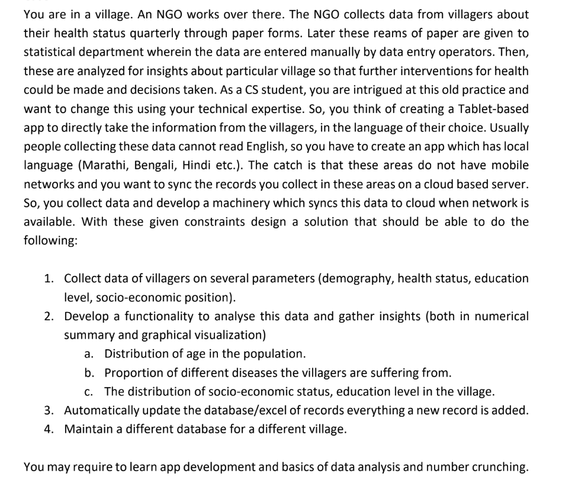
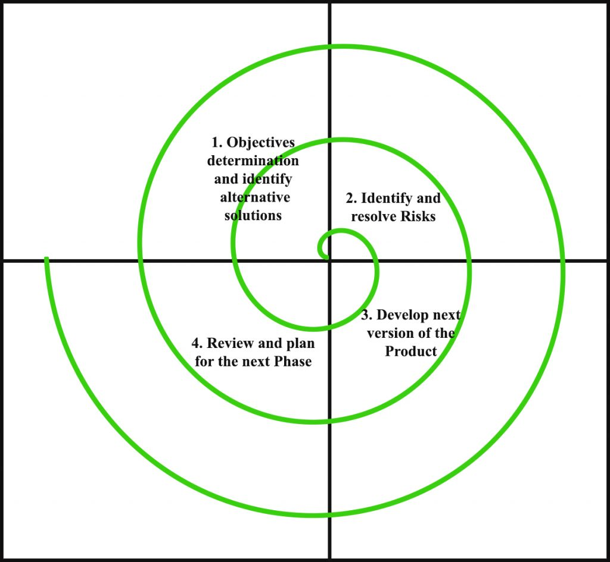
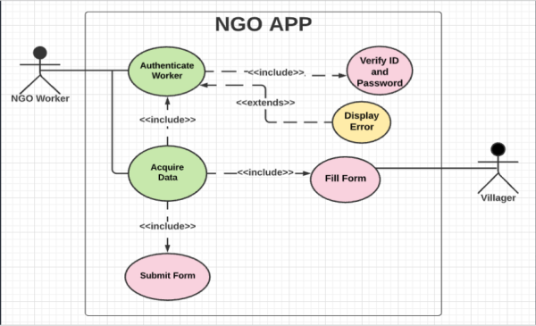
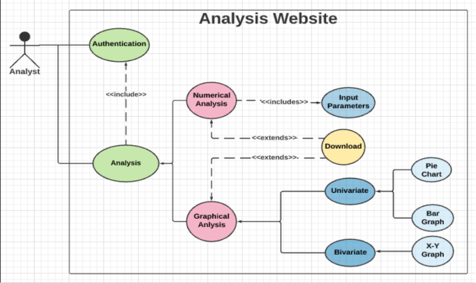
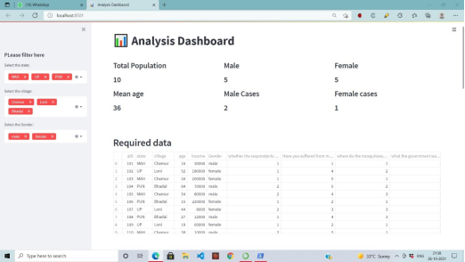

# Software Engineering

## Aim: 
The aim of this project is to understand in depth the principles and methodologies of software engineering. 

## Problem Statement:

   

## SDLC Adopted: 
We have chosen the <b>spiral model</b> as our SDLC as it specifically emphasizes the risk management aspect of development. Our project till now has gone through many revisions in terms of implementation and requirements.

   

## System Overview:
The overall system is divided into two separate parts:

1. <b>NGO App:</b> NGO APP is used for data collection and will be operated by NGO operators. All data entries are collected and stored into their device. As soon as network is available, data is transfered to main server securely. The operators have options to choose the desired language of interface and survey forms.
     
   
   + Fig: Use case diagram for NGO APP
    

2. <b>Analysis Engine</b>: Analysis engine  is used for analyzing data on main server and operated by data analysts. Analysis reports are generated automatically as soon as data analysts specify the desired parameters.
   
   
   + Fig: Use case diagram for Analysis Website   

   

   

## Implementation Overview:

   

   

## Drive Link (Private)):
https://drive.google.com/drive/folders/1a_u-7RyKouysaWQEXK4dHgO_4xH7VdBj?usp=sharing
